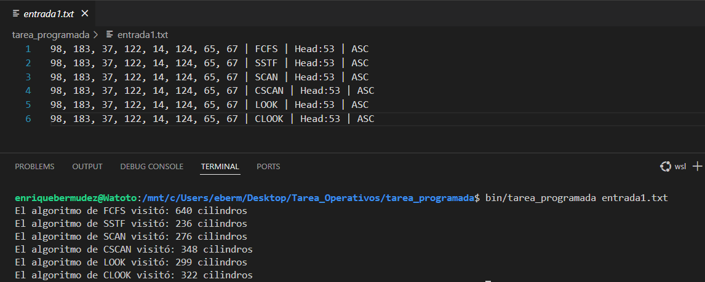
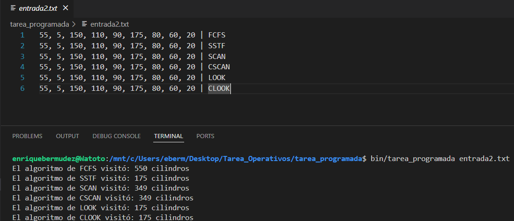
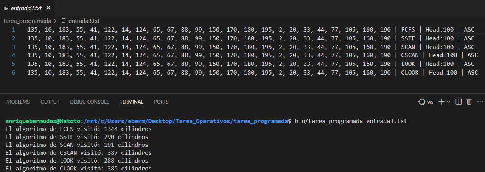
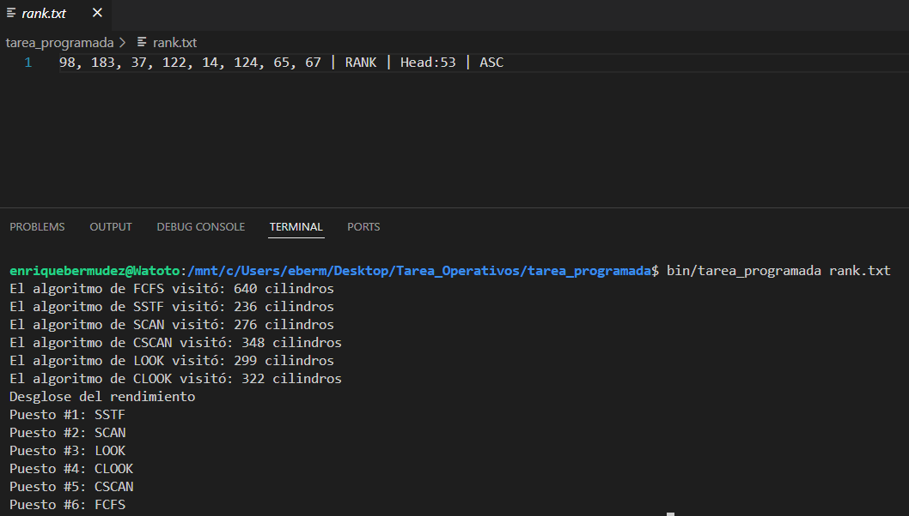
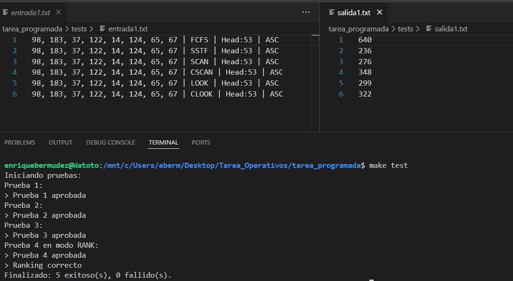

# CI-0122 Sistemas Operativos

## Tarea Programada I: HDD Scheduling

Integrantes:
- Diego Cerdas C21988
- Enrique Bermúdez B81083

### Instrucciones
Para esta tarea, debe trabajar en un programa que reciba una cadena de solicitudes de
acceso a bloques de un disco, el algoritmo a utilizar, la posición en la que se encuentra la cabeza de
lectura y la dirección en la que va leyendo. Tome en cuenta que la cadena de solicitudes y el algoritmo
son parámetros obligatorios, mientras que los siguientes dos parámetros podrían no indicarse,
por lo que su programa debe tener la capacidad de asumir valores por defecto para estos dos.

En este caso, los algoritmos, cuya funcionalidad debe programar, son:

- FCFS
- SSTF
- Scan
- C-Scan
- Look
- C-Look

Entonces, asuma que su programa puede recibir una entrada como la siguiente:

    98, 183, 37, 122, 14, 124, 65, 67 | FCFS | Head:53 | ASC

Su programa debe dar como resultado la cantidad de cilindros
que fueron recorridos para lograr suplir todas las necesidades, 
como se muestra a continuación:

    “Total del recorrido: 640”

## Compilación y Ejecución

  - Asegurarse de estar en la siguiente ruta:

    .. /TAREA_OPERATIVOS/tarea_programada/

1. Para compilar, escriba el comando:
    
        make 

2. Si planea compilar más de una vez, para mayor seguridad utilice: 
      
        make clean && make

3. Para ejecutar con el archivo default (entrada1.txt):
    
        ./bin/tarea_programada

3. Si desea utilizar otro archivo.txt, añada su nombre como segundo argumento
    
        ./bin/tarea_programada ejemplo.txt

## Compilación para Pruebas

Después de haber compilado el archivo, se puede ejecutar el comando:

          make test

para utilizar todas las entradas en la carpeta "tests" como pruebas gracias al archivo shell "test.sh".
Si desea agregar o modificar pruebas, recuerde agregar las soluciones al archivo salidaX.txt correspondiente (input: entrada1.txt, output: salida1.txt).

** Para casos que utilicen la funcionalidad RANK, favor agregar uno por archivo, ya que estas pruebas se hacen comparando strings directamente (ej: entrada4.txt)

## Imágenes de Resultados (Ver en carpeta "img")

1. Entrada1.txt

2. Entrada2.txt

3. Entrada3.txt

4. Rank.txt (entrada4.txt en tests)

5. Casos de Prueba

